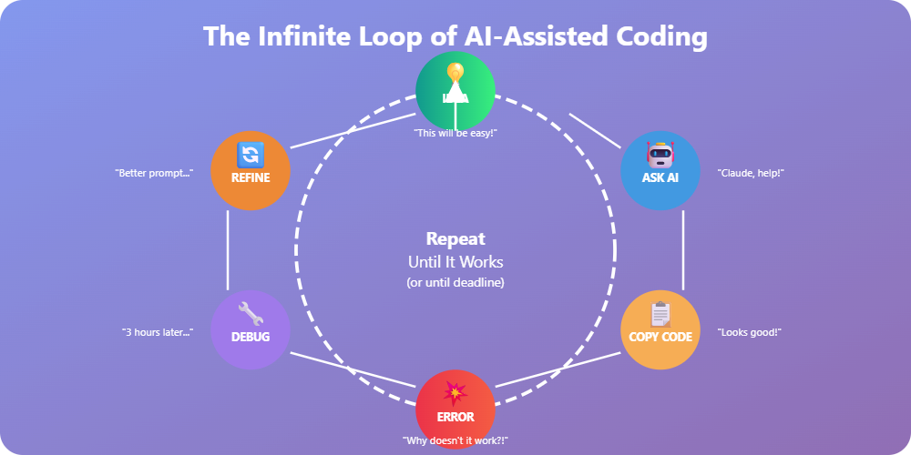

# 👋 Yo, I'm Abdul Hannan Bhatti

<div align="center">


[](https://github.com/hanan-bhatti)
[](https://github.com/hanan-bhatti)

</div>

> *"Code. Debug. Repeat. Cry a little. Code some more."*
> 
> — Every developer ever (including me)

---

## 🎭 The Honest Bio

**Full Stack Engineer** | React/Next.js + FastAPI Wizard 🧙‍♂️ | Professional Bug Creator & Occasional Fixer

📍 Based in: **Lahore, Pakistan** (Where the biryani is better than your code)

🎓 **About Me:** I'm that guy who started coding in September 2024 and somehow ended up with **37 repositories** (21 public, 16 private) by November 2025. Yes, I have a problem. No, I don't need help. Maybe. Send coffee ☕

**Fun Fact:** I maintain more repos than I have followers (4, to be exact). Quality over quantity? Nah, I'm going for chaos over everything 😎

**Hireable Status:** ✅ **OPEN FOR WORK** (Please hire me, my coffee addiction isn't going to fund itself)

---

## 💼 What I Actually Do (When Not Overthinking Variable Names)

```javascript
const abdul_hannan = {
  role: "Full Stack Engineer",
  location: "Lahore, Punjab, Pakistan",
  currentlyWorking: "Building cool stuff & breaking production occasionally",
  education: "Self-taught developer with a PhD in Stack Overflow",
  languages: ["JavaScript", "TypeScript", "Python", "SQL", "HTML", "CSS"],
  askMeAbout: ["Web Dev", "FastAPI", "React", "Next.js", "How to center a div"],
  technologies: {
    frontEnd: {
      js: ["React", "Next.js", "JavaScript", "TypeScript"],
      css: ["Tailwind CSS", "Bootstrap", "SCSS", "Material-UI"]
    },
    backEnd: {
      python: ["FastAPI", "Django"],
      js: ["Node.js", "Express"],
    },
    databases: ["MongoDB", "PostgreSQL", "MySQL", "Redis"],
    tools: ["Git", "Docker", "VS Code", "Postman", "GitHub Actions"],
    misc: ["REST APIs", "GraphQL", "JWT", "OAuth", "WebSockets"]
  },
  architecture: ["Single Page Applications", "Microservices", "Serverless", "Progressive Web Apps"],
  currentFocus: "Building scalable full-stack applications & pretending I understand how DNS works",
  funFact: "I have 37 repos but still can't remember git commands without googling them"
};
```

---

## 🛠️ Tech Stack (AKA My Arsenal of Half-Finished Projects)

### 🎨 Frontend Development


**Skill Level:** 🟢 **Intermediate** (I can build a component without Googling... most of the time)

### ⚙️ Backend Development


**Skill Level:** 🟢 **Intermediate** (I can write async functions without questioning my existence)

### 🗄️ Databases & Tools


**Skill Level:** 🟢 **Intermediate** (I know what normalization is and why my database design still sucks)

### ☁️ DevOps & Cloud


**Skill Level:** 🟡 **Beginner-Intermediate** (I can deploy stuff, but Docker Compose files still confuse me)

---

## 🤖 AI-Powered Vibe Coding™ (AKA My Secret Weapons)

<div align="center">

```
╔══════════════════════════════════════════════════════════════════╗
║  "My friends say: 'You can code using AI!'                       ║
║   I say: 'Yeah, and literally ANYONE can... with the right       ║
║   prompt engineering skills, debugging patience, and the         ║
║   ability to explain to an AI why its solution is beautifully    ║
║   wrong for the 47th time.'"                                     ║
║                                                                  ║
║  Translation: AI is a tool, not a replacement for thinking.      ║
║  (But it sure helps when you forget how semicolons work)         ║
╚══════════════════════════════════════════════════════════════════╝
```

</div>

### 🎨 My AI Arsenal (The Dream Team of Digital Assistants)

<div align="center">


</div>

```python
class VibeCodingSession:
    """
    My actual coding workflow (no cap, fr fr)
    """
    def __init__(self):
        self.ai_assistants = {
            "claude": "For when I need someone who actually understands context",
            "chatgpt": "For when I need quick answers and don't mind hallucinations",
            "gemini": "For when I want Google's opinion on my life choices",
            "perplexity": "For when I need sources (and ego validation)",
            "google": "For when even AI can't save me"
        }
        self.skill_level = "Schrodinger's Developer"  # Simultaneously expert and imposter
        self.reality = "Using AI doesn't make coding easier, it makes failing faster"
    
    def code_something(self, task):
        """
        Step 1: Ask AI
        Step 2: AI gives solution
        Step 3: Copy code
        Step 4: It doesn't work
        Step 5: Spend 3 hours debugging AI's solution
        Step 6: Realize the problem was a typo in MY prompt
        Step 7: Existential crisis
        Step 8: Repeat
        """
        prompts_tried = 0
        success = False
        
        while not success and prompts_tried < float('inf'):
            response = self.ask_ai_assistant(task)
            success = self.debug_ai_response(response)
            prompts_tried += 1
            self.question_life_choices()
        
        return "It works! (I think... let's not touch it)"
    
    def the_truth_nobody_tells_you(self):
        return """
        🎭 THE REALITY OF AI-ASSISTED CODING:
        
        ❌ What people think I do:
           "Type a prompt → Get perfect code → Ship to production"
        
        ✅ What I actually do:
           "Type prompt → Get code → Doesn't compile → 
            Refine prompt → Get different code → Still doesn't work →
            Ask 'why' 17 times → Finally understand the problem →
            Realize AI was right but I implemented it wrong →
            Fix my mistake → Pretend I knew all along"
        
        💡 Hot Take: AI makes you a 10x developer...
           at generating bugs 10x faster.
        
        🎯 Real Talk: AI is amazing, but it's like a really smart
           intern who's never seen your codebase, doesn't know your
           requirements, and confidently gives you solutions that
           would've worked perfectly in 2019.
        """
```

<div align="center">

### 🎨 The AI Coding Process




</div>

### 📊 My AI Usage Stats (Totally Real, Trust Me Bro)

```typescript
interface AIUsageStats {
  claude: {
    usage: "80% of the time",
    reason: "Actually understands what I'm trying to do",
    bestFor: "Complex architecture, refactoring, 'why doesn't this work' moments"
  },
  chatgpt: {
    usage: "15% of the time", 
    reason: "Fast responses when I need quick snippets",
    bestFor: "Boilerplate code, simple functions, regex patterns"
  },
  gemini: {
    usage: "3% of the time",
    reason: "When Claude is down and I'm desperate",
    bestFor: "Google-related APIs, general questions"
  },
  perplexity: {
    usage: "1.9% of the time",
    reason: "Research and finding documentation",
    bestFor: "Finding that one Stack Overflow answer with sources"
  },
  google: {
    usage: "0.1% of the time",
    reason: "When all AI has abandoned me",
    bestFor: "Remembering AI exists"
  }
}

// Reality check
const realityCheck = {
  timeSpentCoding: "20%",
  timeSpentPromptEngineering: "30%",
  timeSpentDebuggingAICode: "40%",
  timeSpentQuestioningLifeChoices: "10%"
};
```

### 🎯 The Controversial Opinion Nobody Asked For

<div align="center">

```
╔══════════════════════════════════════════════════════════════╗
║                                                              ║
║  "Anyone can code with AI now!"                              ║
║                                                              ║
║   Me: laughs in 3AM debugging session                        ║
║                                                              ║
║  Yes—AI can write code.                                      ║
║  But can they:                                               ║
║    ✓ Prompt it correctly?                                    ║
║    ✓ Understand what it wrote?                               ║
║    ✓ Debug when it’s confidently wrong?                      ║
║    ✓ Notice when it hallucinated an entire function?         ║
║    ✓ Fit that code into a real codebase?                     ║
║    ✓ Optimize beyond "it works, I guess"?                    ║
║    ✓ Catch the security hole it left behind?                 ║
║                                                              ║
║  AI is a power tool.                                         ║
║  Anyone can hold a chainsaw—                                 ║
║  but not everyone should operate one unsupervised. 🪚        ║
║                                                              ║
║  TL;DR: AI makes coding accessible.                          ║
║        It does *not* make good engineering effortless.       ║
║                                                              ║
╚══════════════════════════════════════════════════════════════╝
```

</div>

---

## 📊 GitHub Stats (The Numbers Don't Lie... Much)

<div align="center">


</div>

---

## ⏰ Weekly Coding Stats (Yes, I Code Too Much)

<div align="center">

[](https://github.com/hanan-bhatti)

</div>

**Translation:** I spend way too much time staring at a screen. Send help (or better yet, send work).

---

## 🏆 GitHub Trophies (Collecting Them Like Pokémon)

<div align="center">

[](https://github.com/hanan-bhatti)

</div>

---

## 🎯 Current Projects & Focus Areas

```python
current_projects = {
    "learning": [
        "Advanced TypeScript patterns (because 'any' isn't always the answer)",
        "Microservices architecture (breaking monoliths for fun)",
        "System design (pretending to know what I'm doing)",
        "Docker & Kubernetes (container orchestration sounds fancy)",
        "Prompt engineering (yes, it's a real skill now)"
    ],
    "building": [
        "Full-stack FastAPI + Next.js applications",
        "REST APIs that don't return 500 errors (hopefully)",
        "Modern web applications with authentication (JWT tokens everywhere)",
        "Projects that might actually get finished this time",
        "AI-powered tools (using AI to build AI stuff, very meta)"
    ],
    "side_quests": [
        "Contributing to open source (when I'm brave enough)",
        "Writing clean code (still a work in progress)",
        "Refactoring old projects (narrator: he never will)",
        "Actually finishing my README files (ironic, isn't it?)",
        "Teaching AI not to gaslight me about my own code"
    ]
}
```

---

## 📈 Contribution Graph (Proof That I Code)

<div align="center">

[](https://github.com/hanan-bhatti)

</div>

---

## 🐍 Contribution Snake (Watch It Eat My Commits)

<div align="center">


</div>

> **Note:** If the snake isn't showing, I probably forgot to set up the GitHub Action. Classic me.

---

## 💭 Random Dev Thoughts

- **When it works:** "I'm a genius!"
- **When it breaks:** "Who wrote this garbage code?!" *(checks git blame)* "Oh... it was me."
- **When AI works:** "I'm an amazing prompt engineer!"
- **When AI fails:** "These stupid models don't understand anything!"
- **Debugging:** The art of removing bugs I've personally inserted (with AI's help)
- **Code Review:** That moment when your code is judged harder than a cooking competition
- **Git Commit:** "Fixed bug" *(adds 3 more bugs)*
- **Documentation:** That thing I'll write tomorrow (spoiler: I won't)
- **AI Prompting:** Arguing with a chatbot about why its solution won't work in production

---

## 🎵 Currently Vibing To

<div align="center">

[](https://github.com/kittinan/spotify-github-profile)

</div>

---

## ⚡ Recent Activity

<div align="center">

<!--START_SECTION:activity-->
1. 🎉 Merged PR [#2](https://github.com/hanan-bhatti/second-brain/pull/2) in [hanan-bhatti/second-brain](https://github.com/hanan-bhatti/second-brain)
<!--END_SECTION:activity-->
1. ❌ Closed PR [#1](undefined) in [bitcorrupt/Blood-Bank-Management-System](https://github.com/bitcorrupt/Blood-Bank-Management-System)
<!-- END_SECTION:activity -->
</div>

---

## 👨‍💻 Visitor Count

<div align="center">


</div>

---

## 🌟 Featured Projects (Coming Soon™)

```javascript
// TODO: Actually finish some projects to feature here
// TODO: Stop starting new projects before finishing old ones
// TODO: Maybe update this README when projects are done
// TODO: Ask AI to finish my projects (wait, that won't work either)
// TODO: Who am I kidding? Let's start another project!
```

*"I have 37 repos, and I'm proud of... some of them. Okay, maybe 3. Fine, 1. Alright, I'm working on it!"*

---

## 📫 How to Reach Me (If You Dare)

<div align="center">

[](https://github.com/hanan-bhatti)
[](https://linkedin.com/in/hanan-bhatti)
[](mailto:hannanbhatti2006@gmail.com)
[](https://hanan-bhatti.site)

</div>

**Response Time:** Usually pretty fast (unless I'm debugging, then please allow 3-5 business days of existential crisis)

---

## 🎓 Education & Journey

- 🎯 **Started Coding:** September 2024
- 📚 **Learning Method:** Stack Overflow University + YouTube Academy + Trial & Error Institute + AI Prompt Engineering School
- 🏆 **Achievements:** Survived merge conflicts, understood async/await, centered a div, successfully argued with AI about my own code
- 💼 **Current Status:** Open to opportunities (especially if they involve good coffee)

---

## 🎨 Coding Philosophy

```typescript
interface DeveloperPhilosophy {
  codeQuality: "Trying my best";
  testing: "If it compiles, ship it";
  documentation: "The code IS the documentation";
  bugs: "They're not bugs, they're features";
  deadlines: "More like... guidelines";
  coffeeIntake: "Yes";
  aiUsage: "Constantly";
}

const myPhilosophy: DeveloperPhilosophy = {
  codeQuality: "Actually pretty serious about this one",
  testing: "Working on it...",
  documentation: "Getting better at it!",
  bugs: "Okay fine, I'll fix them",
  deadlines: "I respect them, I promise",
  coffeeIntake: "UNLIMITED ☕",
  aiUsage: "Strategic partner in crime"
};
```

---

## 🎮 When I'm Not Coding

- ☕ Drinking coffee (my primary fuel source)
- 🌙 Scrolling through GitHub at 3 AM (healthy habits, right?)
- 📱 Thinking about side projects (while ignoring current projects)
- 🎵 Listening to lo-fi beats to code/relax to
- 🍕 Eating comfort food while debugging
- 🤔 Wondering why my code works in dev but not in production
- 🤖 Chatting with AI about life, the universe, and why CSS is the way it is

---

## 💡 Pro Tips I've Learned (The Hard Way)

1. **Always commit before experimenting** *(Learned this at 2 AM)*
2. **Read the documentation** *(Okay, I'm still working on this one)*
3. **Coffee is essential** *(This one I've mastered)*
4. **Git push --force is dangerous** *(RIP to that one repo)*
5. **Copy-pasting from Stack Overflow is an art** *(But understanding it is better)*
6. **There's always a semicolon missing somewhere** *(Or is there?)*
7. **AI is your co-pilot, not your autopilot** *(Learned after 47 failed deployments)*
8. **Always question AI's confidence** *(It's often inversely proportional to correctness)*

---

## 🤝 Open to Collaborate On

- 🚀 Full-stack web applications
- 🔥 Open source projects
- 💼 Freelance work
- 🎓 Learning new technologies together
- 🍕 Pizza-themed hackathons (is this a thing? It should be)
- 🤖 AI-powered anything (I'm curious, not an expert)

---

## 📝 Latest Blog Posts
<!-- BLOG-POST-LIST:START -->
*Coming soon... once I actually start that blog I keep talking about (and asking AI to write for me)*
<!-- BLOG-POST-LIST:END -->

---

<div align="center">

### 💬 Quote of the Day


---

## ☕ Support My Caffeine Addiction

If you like my work (or just feel sorry for my coffee dependency), consider buying me a coffee!

[](https://www.buymeacoffee.com/hananbhatti)

*Fun fact: 80% of my code is written under the influence of caffeine. The other 20% explains the bugs.*

---

## 🎭 Final Words

> "Talk is cheap. Show me the code." — Linus Torvalds

> "Code is like humor. When you have to explain it, it's bad." — Cory House

> "First, solve the problem. Then, write the code." — John Johnson

> "I'm not a great programmer; I'm just a good programmer with great habits." — Kent Beck

> "AI doesn't write code. You write prompts that convince AI to write code that you then debug." — Me, probably

### My Version:
> "I'm just a developer trying to make sense of my own code six months later, with AI's help, while questioning if I even wrote it or if it was Claude all along."
> 
> — Abdul Hannan Bhatti, 2025

---

### 🌟 If you made it this far, you deserve a medal 🏅

**Thanks for stopping by!**


**Now go forth and code something awesome!** 🚀

*(Or just ask AI to do it and spend the next 3 hours debugging. Either way works.)*

---

*P.S. - Yes, this README is longer than my actual code documentation. Judge me.*

*P.P.S. - If you're still reading, you might have too much free time. Or you're procrastinating. Same.*

*P.P.P.S. - About 60% of this README was written with AI assistance. The other 40% was me adding jokes. You can't tell which is which, and that's the point.* 😏

---

**Last Updated:** November 2025 (Will update when I remember... or never... or when AI reminds me)

⭐️ From [hanan-bhatti](https://github.com/hanan-bhatti) with ❤️, too much ☕, and a little help from 🤖

</div>
